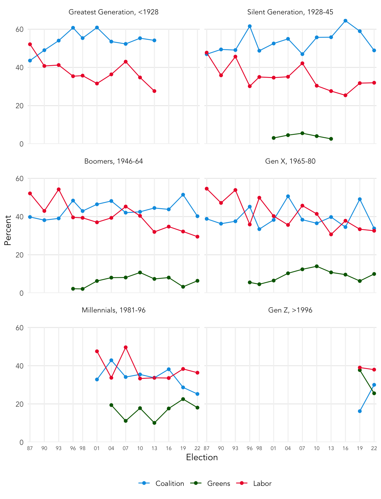

::: {.cell}

```{.r .cell-code}
library(knitr)

library(tidyverse)
library(here)
library(ggplot2)
library(ussc)
load(here("data/d.RData"))
```
:::

::: {.cell hash='simon_launch_oped_cache/html/unnamed-chunk-2_07243982289d154720462d06c9d33b3a'}

```{.r .cell-code}
## make birth year the x-axis
mymodel <- function(obj,outcome){
  require(mgcv)
  obj <- obj %>%
    filter(!is.na(hvote_collapse)) %>% 
    mutate(year_fct = factor(year)) %>% 
    mutate(y = factor(hvote_collapse == outcome))
  
  ndata <- obj %>% 
    distinct(birth_year,year) %>% 
    mutate(age = year - birth_year) %>% 
    filter(age > 17 & age < 85) %>% 
    mutate(year_fct = factor(year))
  
  m <- gam(y ~ s(birth_year,year_fct,bs="fs",k=3),
           data = obj,
           family = binomial,
           weight = weight)
  
  ndata <- ndata %>%
    mutate(phat = predict(m, newdata = ndata, type = "response"))
  
  return(ndata)
}

m <- list()
m[["Coalition"]] <- mymodel(d,"Coalition")
m[["Labor"]] <- mymodel(d,"Labor")
m[["Greens"]] <- mymodel(d,"Greens")

plotData <- bind_rows(m, .id = "hvote") %>%
  mutate(phat = phat * 100,
         y2022 = year == 2022)

save("plotData",file = here("data/plotData.RData"))
```
:::


Data from the 2022 Australian Election Study paints a dire picture for the Coalition, with its support at historic lows among younger Australians.

Across the democratic world, it is almost _always_ the case that younger voters tend left/centre-left and that voters become more conservative with age; the aphorism about being a socialist in one's 20s but not by middle age does have a modest basis in reality.  Each Australian Election Study conducted since 1987 finds older voters more likely to support the Coalition and that Labor's support modestly declines over the age distribution of the electorate. 

The 2022 Australian Election Study adds a dramatic exclamation point to this long-standing truism of Australian politics.   

2022 was a shocker for the Coalition, its vote share falling in almost every age group.   But the Coalition's standing among younger voters has fallen to historic lows.  

**Only about 1 in 4 voters under the age of 40 report voting for the Coalition in 2022**, as shown in @fig-one. 

At no time in the 35 year history of the Australian Election Study have we observed such a low level of support for either major party in so large a segment of the electorate.  


::: {.cell}

```{.r .cell-code}
load(here("data/plotData.RData"))
ggplot(
  plotData %>% filter(phat > .1),
  aes(
    x = birth_year,
    y = phat,
    group = year,
    color = hvote,
    alpha = y2022,
    linewidth = y2022
  )
) +
  geom_line(show.legend = FALSE) +
  scale_color_manual(name = "",
                     values = ussc_colors(c("Coalition", "Labor", "Greens"))) +
  scale_alpha_manual(name = "", values = c("TRUE" = 1, "FALSE" = .33)) +
  scale_linewidth_discrete(
    name = "",
    labels = c("TRUE", "FALSE"),
    breaks = c(1.25, .6),
    range = c(.5, 1)
  ) +
  scale_x_continuous("Birth year") +
  scale_y_continuous(
    "Percentage",
    expand = expansion(add = c(1, 0), mult = c(0, 0)),
    limits = c(0, max(plotData$phat)),
    breaks = seq(0, 60, by = 10)
  ) +
  facet_wrap(~ hvote) +
  theme_minimal(base_family = "Avenir") +
  theme(panel.grid.minor = element_blank(),
        axis.text.x.bottom = element_text(size = 7))
```

::: {.cell-output-display}
{#fig-one width=624}
:::
:::

::: {.cell}

```{.r .cell-code}
fig_one <- plotData %>% filter(phat > .1)
write.csv(fig_one,
          file = here("data/fig_one.csv"),
          row.names = FALSE)
```
:::


While a standout feature of the 2022 election, historically low-levels of support for the Coalition among younger generations of voters says much about the likely _future_ of Australian politics.  Will younger voters trend back towards the Coalition as they grow older, as new leaders and issues replace those of the 2022 election?   

The reservoir of data accumulated over the 35 year history of the Australian Election Study can help us answer this question.   We consistently observe "life cycle" effects in political loyalties; for instance, becoming more conservative as one ages.  But the AES data shows these effects to be mild.  **Large, enduring changes in levels of political support over the life course are unusual in Australian politics.**  When examining the trajectories of voting preferences *within* generations (@fig-two) the larger and more compelling features are (1) "generational imprinting" and (2) effects specific to a particular election or set of party leaders.

These patterns provide important context for the decline in Coalition support observed in 2022. **Between 2016 and 2022, over just two election cycles, Millennials record a large fall in Coalition support, dropping from 38% to 25% in just two election cycles.** Changes of this magnitude and this pace are rare in Australian electoral history, perhaps rivalled only by the Greatest Generation's drift to the Coalition between 1987 and 1996 (top-left panel, @fig-two).


::: {.cell}

```{.r .cell-code}
v <- d %>%
  filter(!is.na(hvote_collapse)) %>%
  count(year, generations, hvote_collapse, wt = weight) %>%
  group_by(year, generations) %>%
  mutate(p = n / sum(n) * 100) %>%
  ungroup()

median_ages_generations_year <- d %>%
  filter(!is.na(hvote_collapse)) %>%
  group_by(generations, year) %>%
  summarise(age = floor(median(age, na.rm = TRUE)),
            n = n()) %>%
  ungroup() %>%
  left_join(
    v %>%
      filter(hvote_collapse %in% c("Coalition", "Labor", "Greens")) %>%
      group_by(year, generations) %>%
      summarise(flag = all(n < 10)) %>%
      ungroup(),
    by = c("generations", "year")
  ) %>%
  mutate(age = if_else(flag, NA_real_, age))

vlines <- expand_grid(
  year = d %>% distinct(year) %>% pull(year),
  generations = d %>% distinct(generations) %>% pull(generations),
  hvote_collapse = c("Coalition", "Labor", "Greens")
) %>%
  mutate(y_lo = 0, y_hi = 60)

fig_two <- v %>%
  mutate(p = if_else(n < 10, NA_real_, p)) %>%
  mutate(p = if_else(
    generations == "Gen Z, >1996" & year == 2016,
    NA_real_,
    p)
    ) %>% 
  filter(hvote_collapse %in% c("Coalition", "Labor", "Greens"))

write.csv(fig_two,
          file = here("data/fig_two.csv"))

ggplot(fig_two,
       aes(
         x = year,
         y = p,
         group = hvote_collapse,
         color = hvote_collapse
       )) +
  geom_segment(
    data = vlines,
    inherit.aes = FALSE,
    color = gray(.95),
    aes(
      x = year,
      xend = year,
      y = y_lo,
      yend = y_hi
    )
  ) +
  geom_point() +
  geom_line() +
  # geom_text(
  #   data = median_ages_generations_year,
  #   inherit.aes = FALSE,
  #   aes(x = year,
  #       label = age,
  #       y = 65),
  #   size = 2,
  #   vjust = 0
  # ) +
  scale_color_manual(name = "",
                     values = ussc_colors(c("Coalition", "Labor", "Greens"))) +
  scale_y_continuous(
    "Percent",
    minor_breaks = NULL,
    expand = expansion(add = c(0, 1)),
    limits = c(0, max(fig_two$p))
  ) +
  scale_x_continuous(
    "Election",
    expand = expansion(add = c(1/2, 1/2)),
    breaks = unique(v$year),
    labels = function(x) {
      str_sub(x, 3, 4)
    },
    minor_breaks = NULL
  ) +
  facet_wrap( ~ generations,nrow = 3, ncol = 2) +
  theme_minimal(base_family = "Avenir") +
  theme(panel.grid.major.x = element_blank(),
        panel.spacing.y = unit(12,"pt"),
        legend.position = "bottom",
        axis.text.x = element_text(size = 6.5))
```

::: {.cell-output-display}
{#fig-two width=624}
:::
:::


Generation Z, born after 1996, generate meaningful quantities of data for just the 2019 and 2022 elections. But in these two elections just 26% of this group reported voting for the Coalition, and 67% voting either Green or Labor.   

No other generation records such lop-sided preferences at similarly early stages of the life course.

Millennials entered the electorate in the early 2000s with about 35% of this generation supporting the Coalition, a level which has now fallen to 25%. Gen X first appear in the AES in 1987, with 40% reporting support for the Coalition, with a slight trend away from this level in the 35 years since. Labor's vote has waned somewhat among Gen X, but almost entirely made up for in two-party preferred terms by Gen X's turn towards the Greens.

If and how the Coalition addresses this overwhelming deficit of support among younger generations is perhaps the single biggest question in Australian politics.   Conversely, how stable is the ensemble of voting blocs (Labor, Green and independents) that drove the Coalition's seat share in the House of Representatives to levels not seen since 1940, delivering Labor a governing majority with less than 1 in 3 first preference votes?

The AES does find some exceptional factors specific to the 2022 election, that will not be as relevant in the next federal election.   In particular, **Scott Morrison  was the least popular prime minister or leader of the opposition to contest an Australian election since AES started measuring leader popularity in 1990.** Morrison rated 3.8 on a ten point, dislike-to-like scale; figures for other losing prime ministers include Kevin Rudd (4.0, 2013), Paul Keating (4.2, 1996) and John Howard (5.1, 2007).  

How much anti-Coalition sentiment in 2022 was driven by Morrison's historic unpopularity can't be known precisely. But the AES suggests that 2022 was a less issue-based election than 2019, with 53% of voters saying their 2022 choice was driven by policy differences, compared to 66% in 2019.     

Macroeconomic management, climate change and energy policy, industrial relations, the national integrity commission and the Voice to parliament is the substantive terrain over which the parties will compete for votes in 2025.   With Morrison presumably in the rear-view mirror by the next election, Labor's performance on these issues will determine whether it capitalises on the historic opportunity before it, imprinting loyalty to Labor on Gen Z and Millennials over the course of their lives.


_Professor Simon Jackman_ is one of the principal investigators of the 2022 [Australian Election Study](https://australianelectionstudy.org) and is an Honorary Professor at the University of Sydney.


::: {.cell}

```{.r .cell-code}
tmp <- d %>% 
  filter(year == 2022)
v1 <- sum(tmp$weight)
v2 <- sum(tmp$weight^2)
neff <- v1^2/v2
```
:::


Methodological note (did not appear in the _Guardian_ op-ed): The data analysed here draws on 2,424 responses to the 2022 AES, self-administered online or as a mail-out/mail-back survey, fielded in the weeks immediately following the May 2022 election. Survey respondents were randomly selected by first sampling from a database of Australian residential mail addresses and randomly selecting an adult citizen member of the household if more than one adult citizen resides at the address.  This is a slightly smaller subset of the entire set of 2,508 responses to the 2022 AES, after filtering out respondents who did not provide a useable birth year, an age 100 or greater or 17 or younger, or did not provide a useable response when asked about their 2022 House of Representatives vote.

The data are weighted on demographic characteristics including age, gender, educational attainment and region, along with 2022 House of Representatives vote; hence by construction, the distribution of these attributes in the weighted AES data will closely match the distribution of those attributes in the Australian adult citizen population.   In the 2022 AES, the weights on individual respondents vary from 0.19 to 
6.03 and have a variance of 1.01.   This implies that the 2022 AES has an effective sample size of 1,195 and a "maximum margin of error" of $\pm$ 2.8 percentage points.   Maximum margins of error will be larger for subgroup analyses and comparisons.

Complete methodological details on the 2022 AES and earlier AES data collections are available from the
[AES website]( https://aes.anu.edu.au). 
